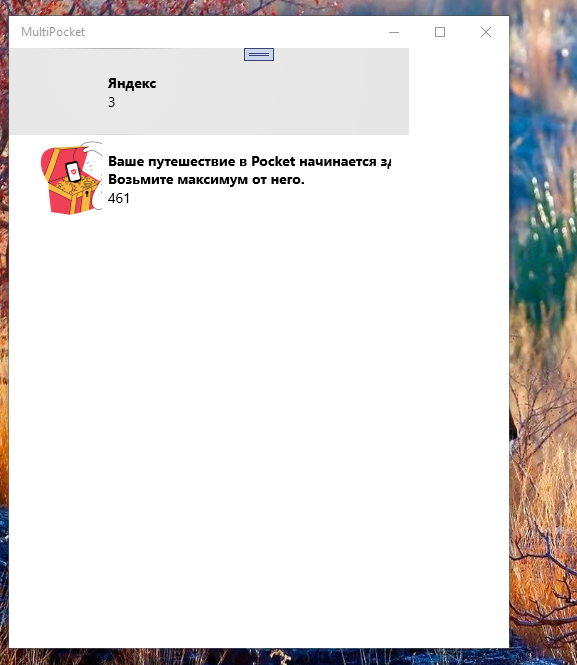
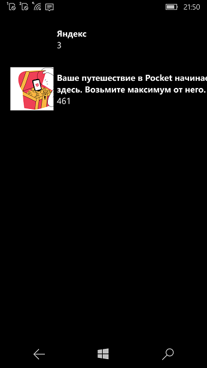

# MultiPocket

## About
The "Multipocket" solution consists of PocketApi project. It is an API wrapper for the "GetPocket" ("Pocket") service.
So, Multipocket is the simplest multi-platform (Win10/11/Win10Mobile) client (template) for "Pocket". :) 

## Screenshots


  

## Overview and Instantiation
This API wrapper works via a PocketClient class.  PocketClient objects need to be authenticated 
prior to making any method calls to retrieve, add or modify pocket items, which are represented by the Models.PocketItem class.

To instantiate a PocketClient object, you can either pass a platform consumer key provided b
y Pocket, or provide an AccessToken object which has previously been returned to you from the 
ObtainAccessToken method on the PocketClient task.  See the Authentication section below for more details.

## Authentication
This API wrapper is written to emulate the authentication process documented at 
https://getpocket.com/developer/docs/authentication

Obtain a platform consumer key as per the getpocket api instructions and pass it to the PocketClient "construtor". 

## Adding items to Pocket
To add a new item to your Pocket, you can call the AddPocketItemAsync method, passing in a Uri 
for the item you wish to add, for example:
```
 PocketItem newPocketItem = await _pocketClient.AddPocketItemAsync
(
   new Uri("https://www.theage.com.au/culture/comedy/the-at-home-comedy-festival-20200318-p54bhu.html")
);
```

## Modifying items in Pocket
To modify an existing item in Pocket, you can call the following methods to archive, re-add, 
mark favorite, un-favorite and delete an item:
```
bool result;
result = await _pocketClient.ArchivePocketItemAsync(pocketItem);
result = await _pocketClient.ReAddPocketItemAsync(pocketItem);
result = await _pocketClient.MarkFavoritePocketItemAsync(pocketItem);
result = await _pocketClient.UnFavoritePocketItemAsync(pocketItem);
result = await _pocketClient.DeletePocketItemAsync(pocketItem);
```

## Retrieving items from Pocket
To retrieve a list of items in your pocket, there are two options.  You can retrieve all the items 
in your Pocket, or all the modified items in your pocket since the last time you retrieved your items.

To retrieve all items in your Pocket, issue the following code:
```
List<PocketItem> pocketItems = await _pocketClient.GetPocketItemsAsync();
```

To retrieve the modified items in your Pocket since your last retrieval, call the same method, 
but include the DateTime of your last retrieval.  All modified items will be retrieved since that date.  
It is recommended you primarily use this function, rather than retrieving all the items in your Pocket with each call.
```
List<PocketItem> pocketItems = await _pocketClient.GetPocketItemsAsync(new DateTime(2020,1,1));
```

## 2 words more

The Pocket API available at https://getpocket.com/developer/.

When you go registation, obtain tho consumer keys : Desktop and Mobile. 

For x64 target compiling, use Desktop key. For ARM target, use Mobile key. :)

Good luck!  

-- [me][e] 2022